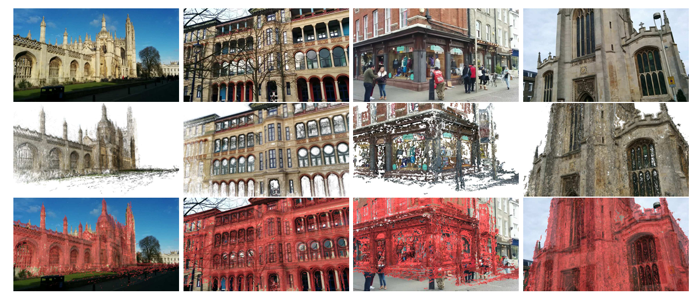
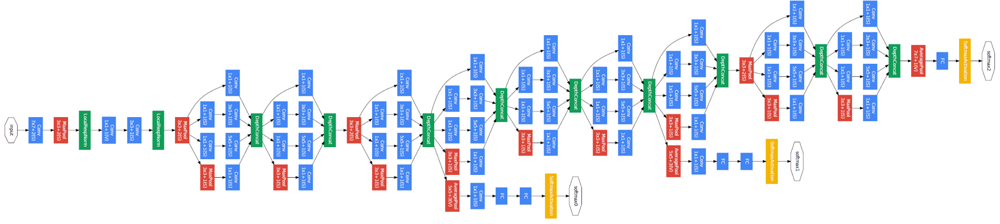
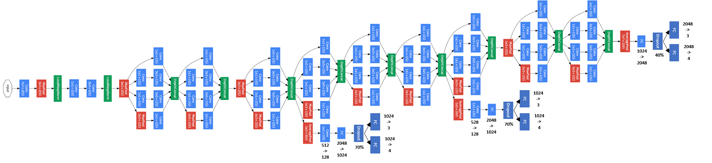

# Camera Pose Regression with PoseNet

This project implements a PoseNet-based 6-DoF camera pose regression model. Given a single RGB image, the model directly regresses the camera translation `xyz` and orientation quaternion `wpqr`.

The experiment uses the `KingsCollege` scene from the Cambridge Landmarks dataset and builds PoseNet on top of an InceptionV1 / GoogLeNet-style backbone.



## Highlights

- Implements PoseNet in PyTorch.
- Supports initialization from `places-googlenet.pickle` pretrained GoogLeNet weights.
- Uses three pose regression heads for intermediate supervision and final pose prediction.
- Includes training, checkpoint saving, evaluation, and ONNX export scripts.
- Provides the `KingsCollege` dataset, a training loss plot, and a Netron visualization output.

## Project Structure

```text
Camera-Pose-Regression-with-PoseNet/
|-- README.md
|-- .gitignore
|-- Description.pdf
|-- training plot.png
|-- workspace/
|   |-- train.py
|   |-- test.py
|   |-- netron.py
|   |-- posenet.onnx
|   |-- posenet.png
|   |-- __init__.py
|   |-- models/
|   |   |-- PoseNet.py
|   |   |-- __init__.py
|   |-- data/
|   |   |-- DataSource.py
|   |   |-- __init__.py
|   |   |-- datasets/
|   |       |-- readme.txt
|   |       |-- KingsCollege/
|   |-- pretrained_models/
|   |   |-- places-googlenet.pickle
|   |-- checkpoints/
|   |   |-- epoch_*.pth
|   |-- wandb/
|       |-- run-*/
```

### Directory Overview

| Path | Description |
| --- | --- |
| `workspace/train.py` | Training entry point. Handles data loading, model training, W&B logging, and checkpoint saving. |
| `workspace/test.py` | Evaluation entry point. Loads a selected epoch checkpoint and reports translation and orientation errors. |
| `workspace/netron.py` | Exports PoseNet to ONNX for visualization in Netron. |
| `workspace/models/PoseNet.py` | Main PoseNet implementation, including Inception blocks, pose heads, and loss function. |
| `workspace/data/DataSource.py` | Dataset reader and image preprocessing pipeline for KingsCollege. |
| `workspace/data/datasets/KingsCollege/` | Cambridge Landmarks `KingsCollege` dataset. |
| `workspace/pretrained_models/` | InceptionV1 / GoogLeNet pretrained weights. |
| `workspace/checkpoints/` | Saved `.pth` model checkpoints. |
| `workspace/wandb/` | Local Weights & Biases experiment logs. |
| `training plot.png` | Training loss curve. |
| `Description.pdf` | Project description or assignment specification. |

## Environment

Python 3.9 is recommended. Core dependencies:

```bash
pip install torch==2.2.2 torchvision==0.17.2 numpy==1.23.5 pillow==11.1.0 wandb==0.19.5 onnx==1.17.0
```

To keep W&B logging local, enable offline mode.

PowerShell:

```powershell
$env:WANDB_MODE="offline"
```

Linux / macOS:

```bash
export WANDB_MODE=offline
```

## Dataset

By default, the project expects the dataset at:

```text
workspace/data/datasets/KingsCollege/
```

Important files:

- `dataset_train.txt`: training image paths and pose labels.
- `dataset_test.txt`: testing image paths and pose labels.
- `mean_image.npy`: mean training image used during preprocessing.
- `seq1/` to `seq8/`: image sequences.
- `videos/`: original video files.

Each pose label follows this format:

```text
filename tx ty tz qw qx qy qz
```

If `mean_image.npy` is missing, `DataSource.py` recomputes it from the training images and saves it automatically.

## Model

The main implementation is in `workspace/models/PoseNet.py`.

### InceptionV1 Backbone

PoseNet reuses the InceptionV1 / GoogLeNet feature extractor. The backbone begins with convolution and pooling layers, then stacks Inception blocks from `3a` to `5b`. Each Inception block combines multiple branches, including `1x1`, `3x3`, `5x5`, and pooling projection paths, then concatenates their feature maps along the channel dimension.



### PoseNet Architecture

PoseNet modifies the InceptionV1 backbone for camera relocalization. Instead of using the original image classification output, the network adds pose regression heads that predict translation and orientation:

- Intermediate head after Inception `4a`.
- Intermediate head after Inception `4d`.
- Final head after Inception `5b`.

During training, all three heads contribute to the loss. During evaluation, only the final head is used for prediction.



Key modules:

- `InceptionBlock`: GoogLeNet-style multi-branch convolution block.
- `PoseNet`: full camera pose regression network with three regression heads during training.
- `LossHeader`: final pose regression head.
- `LossHeader2`: auxiliary intermediate regression head.
- `PoseLoss`: weighted combination of translation MSE and quaternion MSE.

Training mode outputs:

```text
loss1_xyz, loss1_wpqr,
loss2_xyz, loss2_wpqr,
loss3_xyz, loss3_wpqr
```

Evaluation mode outputs:

```text
xyz, wpqr
```

## Training

Enter the workspace directory:

```bash
cd workspace
```

Run training with default arguments:

```bash
python train.py
```

Default training arguments:

| Argument | Default |
| --- | --- |
| `epochs` | `200` |
| `batch_size` | `75` |
| `learning_rate` | `0.0001` |
| `save_freq` | `20` |
| `data_dir` | `data/datasets/KingsCollege/` |

You can also pass the arguments explicitly:

```bash
python train.py --epochs 200 --batch_size 75 --learning_rate 0.0001 --save_freq 20 --data_dir data/datasets/KingsCollege/
```

Checkpoints are saved to:

```text
workspace/checkpoints/
```

## Evaluation

Evaluate the default epoch 180 checkpoint:

```bash
cd workspace
python test.py --epoch 180 --batch_size 75
```

The evaluation script prints, for each test image:

- ground-truth pose
- predicted pose
- position error in meters
- orientation error in degrees

Reference result recorded for the current checkpoint:

| Metric | Result |
| --- | ---: |
| Median position error | `3.5984 m` |
| Median orientation error | `2.2383 degrees` |

## ONNX Export and Visualization

Export the model to ONNX:

```bash
cd workspace
python netron.py
```

ONNX output:

```text
workspace/posenet.onnx
```

Netron visualization:

```text
workspace/posenet.png
```

## Results

Training loss curve:


## Reference

Alex Kendall, Matthew Grimes, Roberto Cipolla.

**PoseNet: A Convolutional Network for Real-Time 6-DOF Camera Relocalization.**

ICCV 2015.
